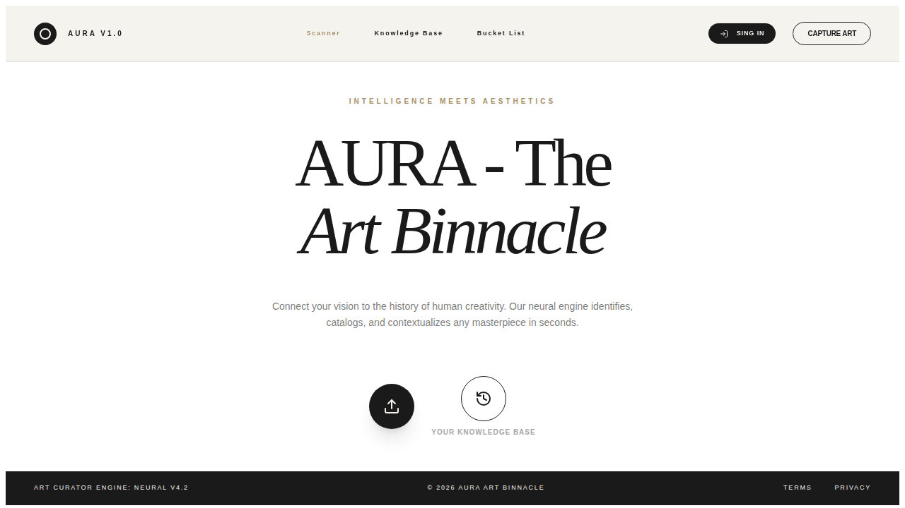
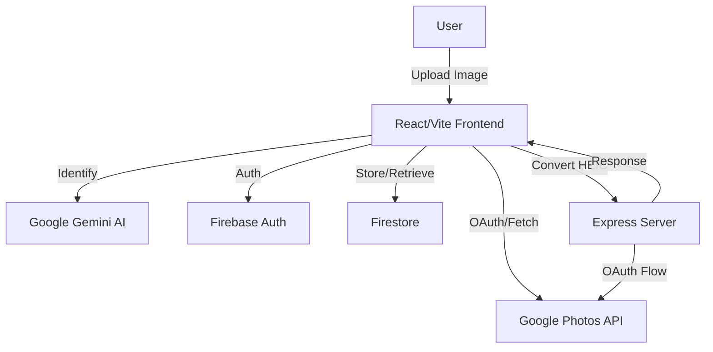
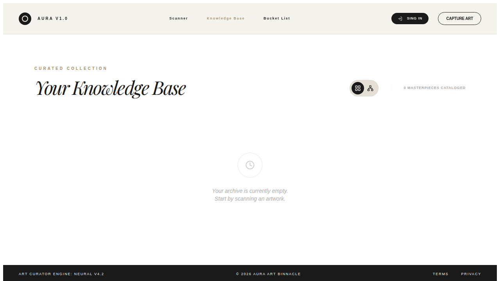
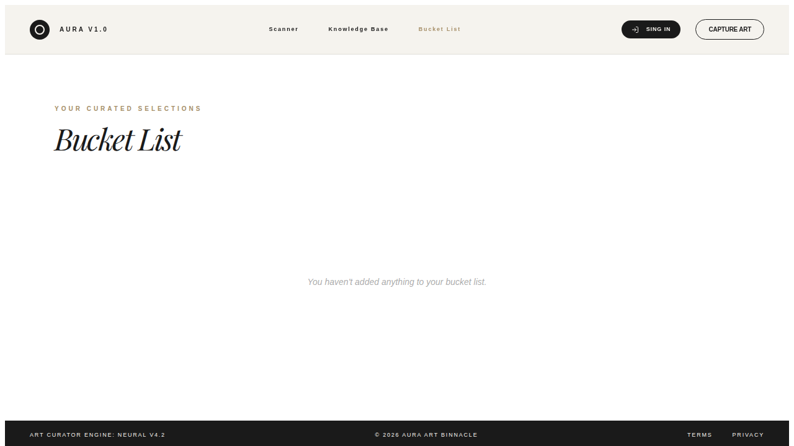

<div align="center">

</div>

# AURA - The Art Binnacle

AURA is a mobile-first web application designed for art enthusiasts to scan, identify, and organize masterpieces. It leverages AI to provide deep insights into artworks and features a dynamic knowledge graph to visualize connections between artists, movements, museums, and locations.

## 🌟 Key Features

- **Capture from Anywhere**: The "Capture" menu is now accessible from both the navigation header and the home hero, allowing you to scan art from any page.
- **Google Photos Integration**: Authenticate with your Google account to import artworks directly from your Google Photos library.
- **Artwork Scanning & Identification**: Instantly identify artworks using Google Gemini AI. Get details on artist, year, movement, medium, and historical context.
- **Advanced Gallery Filtering**: Filter your curated collection by medium, museum, and year range with support for multiple selections.
- **Interactive Knowledge Graph**: Visualize relationships between artists, movements, and museums with directional edges and edge labels. Features include:
    - **Recursive Collapsing**: Collapse nodes to simplify complex views.
    - **Contextual Highlighting**: Select a node to highlight its neighborhood and dim the rest of the graph.
    - **Adaptive Detail**: Labels and icons scale based on zoom level.
- **Bucket List**: Keep track of masterpieces you wish to see in person. Support for Guest mode allows use without an account.
- **Social Sharing**: Share your curated gallery or bucket list with unique public profile links. Support for view-only modes.

## 🛠️ System Requirements & Prerequisites

- **Node.js**: Version 18 or higher.
- **Firebase Project**: For authentication and data persistence.
- **Google Gemini API Key**: For AI-powered image recognition.
- **Browser**: Modern web browser with camera access (for scanning).

## 🚀 Local Setup & Development

1. **Clone the repository**:
   ```bash
   git clone <repository-url>
   cd aura
   ```

2. **Install dependencies**:
   ```bash
   npm install
   ```

3. **Configure Environment Variables**:
   Create a `.env.local` file in the root directory and add the following:
   ```env
   GEMINI_API_KEY="YOUR_GEMINI_API_KEY"
   VITE_FIREBASE_API_KEY="YOUR_FIREBASE_API_KEY"
   APP_URL="http://localhost:3000"
   ```

4. **Firebase Configuration**:
   - Create a file named `firebase-applet-config.json` in the root directory with your Firebase project details:
     ```json
     {
       "apiKey": "...",
       "authDomain": "...",
       "projectId": "...",
       "storageBucket": "...",
       "messagingSenderId": "...",
       "appId": "..."
     }
     ```
   - See [Firebase Setup](#🔥-firebase-setup) for more details.

5. **Run the app**:
   ```bash
   npm run dev
   ```
   The app will be available at `http://localhost:3000`.

## 🔥 Firebase Setup

AURA uses Firebase Firestore for storage and Firebase Auth for user management.

### Firestore Rules
To secure your data, you must apply the security rules found in `firestore.rules`.
1. Go to the **Firestore Database** section in the Firebase Console.
2. Click on the **Rules** tab.
3. Copy the content of `firestore.rules` from this repository and paste it into the editor.
4. Click **Publish**.

### Authentication
Enable **Google Sign-In** in the **Authentication > Sign-in method** section of your Firebase Console.

## 🚢 Deployment

AURA is designed to be deployed to **Cloud Run** via **AI Studio Build**.

1. Ensure your `metadata.json` is correctly configured.
2. Build the project:
   ```bash
   npm run build
   ```
3. Deploy through the AI Studio interface, ensuring that `GEMINI_API_KEY` and other secrets are properly configured in the AI Studio Secrets panel.

## 📊 System Architecture



## 📸 Screenshots

### Knowledge Base


### Bucket List


---
*Built with React, Tailwind CSS, Firebase, and Google Gemini AI.*
